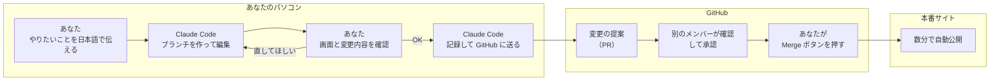
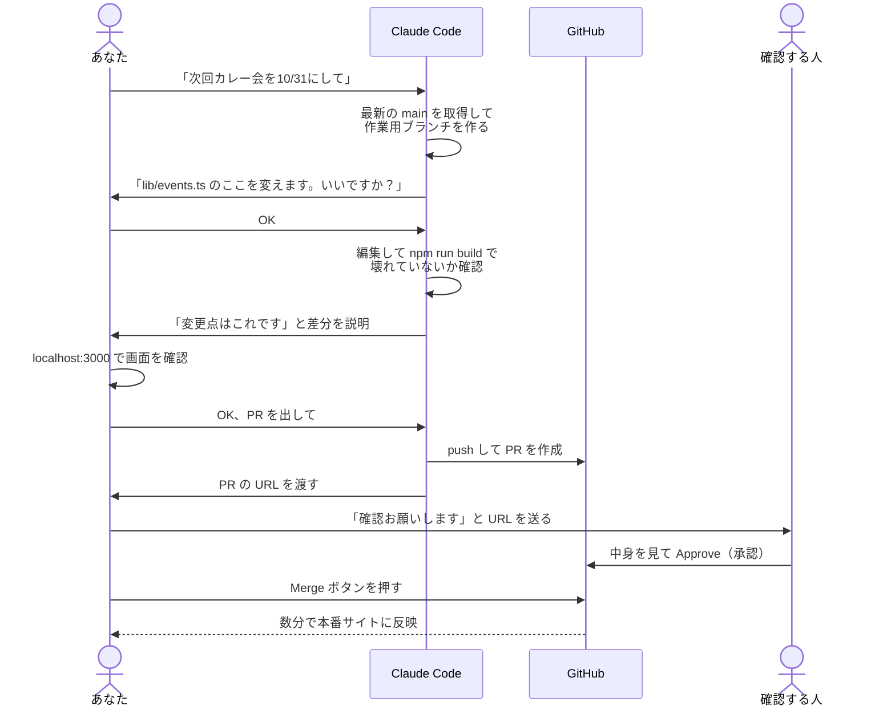
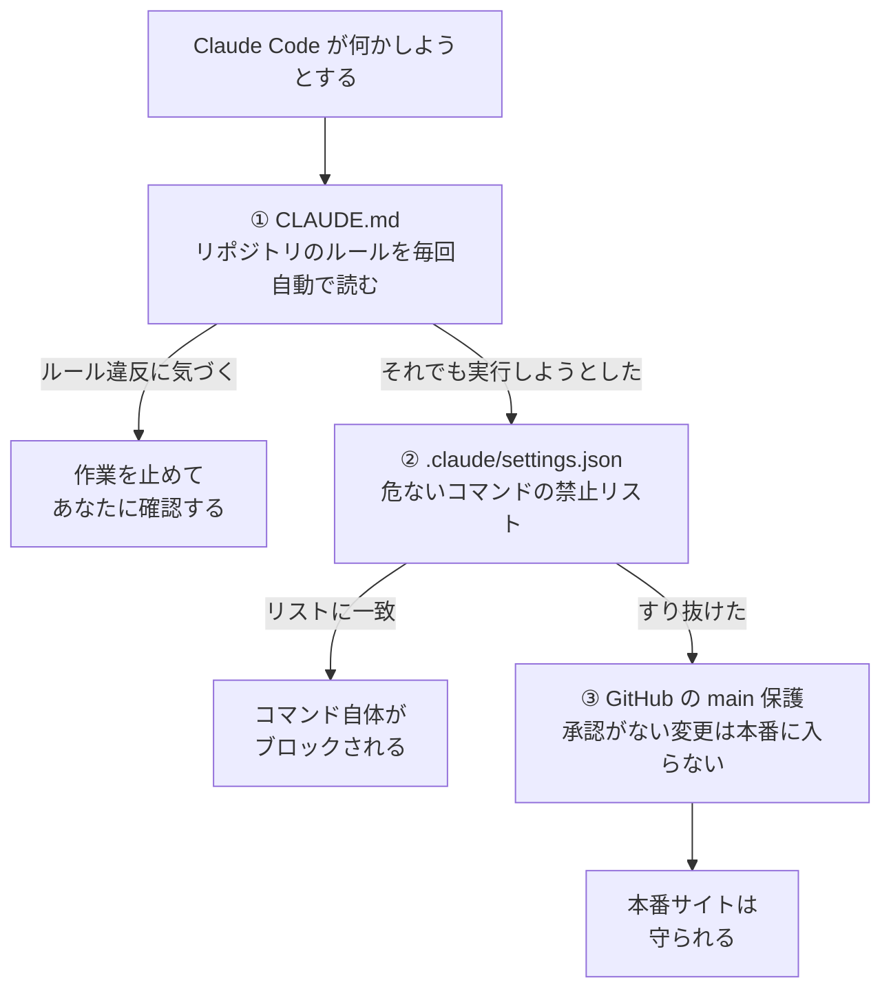
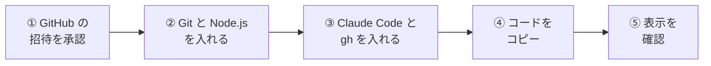
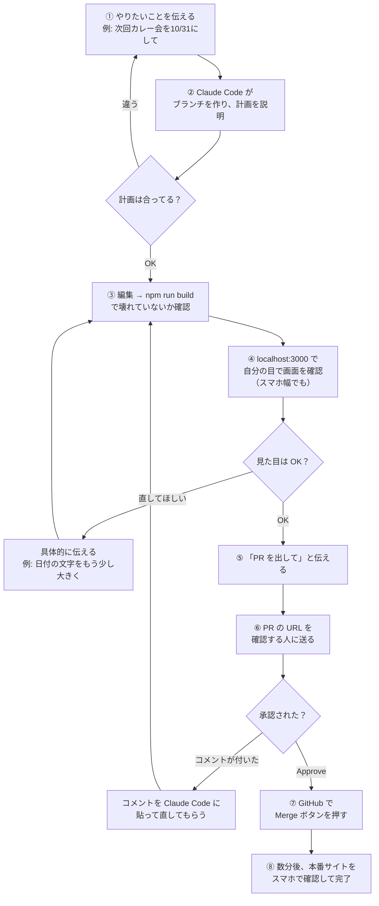
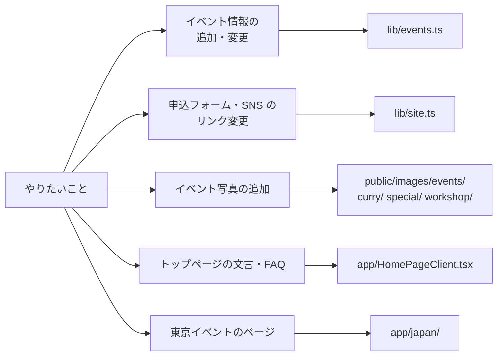
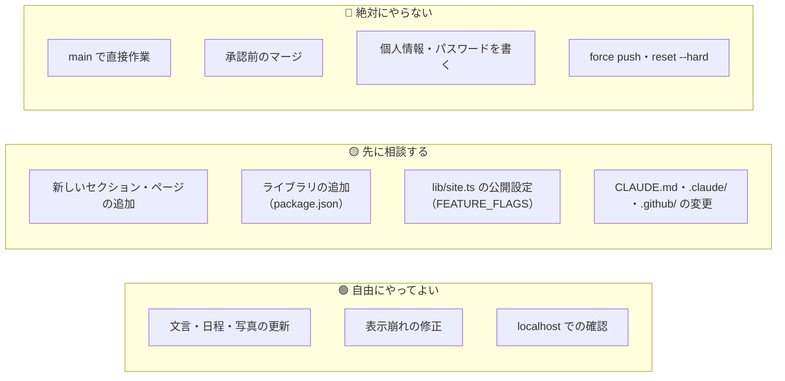
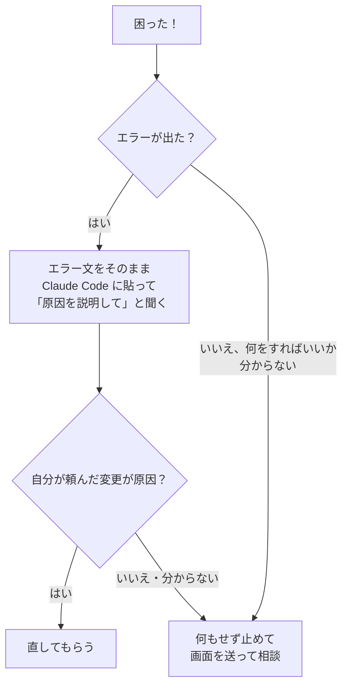

# Claude Code でサイトを編集する手順書

最終更新: 2026-10-06

3rd Place の Web サイトを **Claude Code（AI に作業を頼めるツール）** で編集するための手順書です。
Git や GitHub をはじめて使う人でも、上から順に進めれば
「AI に頼む → 確認する → 本番に出す」まで一人でできるように書いています。

> GitHub 上でこのファイルを開くと、図が絵として表示されます。

---

## 0. ひと目でわかる全体像



覚えることは3つだけです。

1. **AI は「自分専用の作業場所（ブランチ）」で作業する**ので、失敗しても本番サイトは壊れない
2. **本番に出るのは、別のメンバーが承認したあとだけ**
3. **AI が出した変更は、必ず自分の目で確認してから進める**

---

## 1. 誰が何をするか



| 担当 | やること | やらないこと |
|---|---|---|
| **あなた** | 頼む内容を決める／AI の計画に OK を出す／画面を確認する／確認依頼を送る／Merge を押す | AI の出した変更を見ないまま OK を出す |
| **Claude Code** | ブランチ作成・編集・ビルド確認・PR 作成 | main への直接の書き込み・PR のマージ・頼まれていない修正 |
| **確認する人** | PR の中身を見て承認するか、直してほしい点をコメント | — |

---

## 2. Claude Code が勝手に危ないことをしない仕組み



| 層 | ファイル／設定 | 何をしているか |
|---|---|---|
| ① ルール | `CLAUDE.md` の「作業ルール」 | 作業の手順と禁止事項。Claude Code はこのリポジトリを開くたびに自動で読む |
| ② 禁止リスト | `.claude/settings.json` | `main` への push、強制上書き（force push）、`gh pr merge`、`rm -rf`、`.env` の読み取りなどを実行できなくする |
| ③ GitHub | main ブランチの保護設定 | 1人の承認がない PR は main に入れられない |

**この3つのファイル・設定は、あなたも Claude Code も勝手に変えないでください。** 変えたいときは先に相談してください。

---

## 3. 最初の1回だけやる準備



### ① GitHub の招待を承認する

1. GitHub アカウントを作る（https://github.com/signup）
2. 自分の GitHub ユーザー名を、リポジトリの管理者に伝える
3. 届いた招待メール（または https://github.com/dz21106-web/3rd-place-website/invitations ）で **Accept invitation** を押す

これをしないと、Claude Code が GitHub に送る段階で「権限がない（403）」エラーになります。

### ② Git と Node.js を入れる（Mac の場合）

ターミナル（Mac の「アプリケーション → ユーティリティ → ターミナル」）を開いて実行します。

```bash
# Git が入っているか確認する（入っていなければインストール画面が出るので従う）
git --version
```

Node.js（サイトを自分のパソコンで動かすためのソフト）は https://nodejs.org から **LTS 版** をダウンロードして入れます。

```bash
# Node.js が入ったか確認する（v20 以上の番号が出れば OK）
node -v
```

### ③ Claude Code と gh を入れる

```bash
# Claude Code をインストールする
curl -fsSL https://claude.ai/install.sh | bash

# GitHub をターミナルから操作する道具（gh）を入れる。Claude Code が PR を作るときに使う
brew install gh

# gh を自分の GitHub アカウントにつなぐ（ブラウザが開くのでログインして許可する）
gh auth login
```

`brew` が無いと言われたら、https://brew.sh の1行目のコマンドを実行してから、もう一度実行します。

### ④ コードを自分のパソコンにコピーする（clone）

```bash
# デスクトップにサイトのコードをまるごとコピーする
cd ~/Desktop
git clone https://github.com/dz21106-web/3rd-place-website.git
cd 3rd-place-website

# サイトを動かすのに必要な部品をダウンロードする（数分かかる）
npm install
```

### ⑤ 自分のパソコンでサイトを表示してみる

```bash
# 開発用のサーバーを起動する
npm run dev
```

ブラウザで http://localhost:3000 を開いて、サイトが表示されれば準備完了です。
止めるときはターミナルで `Ctrl + C` を押します。

---

## 4. 毎回の作業の流れ

### 4-1. Claude Code を起動する

```bash
# サイトのフォルダに移動して Claude Code を起動する
cd ~/Desktop/3rd-place-website
claude
```

### 4-2. 最初にこの一言を送る

```
CLAUDE.md の「作業ルール」に従って作業してください。
今日やりたいこと：（ここに頼みたい内容を書く）
```

ルールは `CLAUDE.md` に書いてあり自動で読まれますが、最初に一言添えると手順を飛ばしにくくなります。

### 4-3. Claude Code とのやりとり



### 4-4. 各ステップで確認すること

| ステップ | あなたが確認すること |
|---|---|
| ② 計画 | 「どのファイルの、どこを変えるか」が頼んだ内容と合っているか。関係ないファイルが入っていないか |
| ③ ビルド | Claude Code が「`npm run build` 成功」と報告したか |
| ④ 画面 | パソコン幅とスマホ幅（Chrome なら右クリック →「検証」→ 左上のスマホのアイコン）の両方で崩れていないか。日本語と英語の両方が直っているか |
| ⑤ PR | Claude Code が返した URL を開き、「Files changed」タブで変更されたファイルが想定どおりか |
| ⑧ 本番 | 本番サイトで直した場所が反映されているか |

### 4-5. Claude Code が許可を求めてきたら

Claude Code は、コマンドを実行する前に「実行していいですか？」と聞いてくることがあります。

| 聞かれた内容 | 答え方 |
|---|---|
| `npm run build` / `npm run dev` / `git status` / `git diff` | 許可して OK |
| 新しいブランチの作成・`git commit`・自分のブランチへの `git push`・`gh pr create` | 内容を確認してから許可 |
| `main` という言葉を含む push、`--force`、`reset --hard`、`rm -rf`、ファイルの削除 | **許可しない（No）**。何をしようとしたのか聞く |
| 意味が分からないコマンド | **許可しない**で「これは何をするコマンド？」と聞く |

---

## 5. 頼み方のコツ

| ❌ ぼんやりした頼み方 | ✅ 具体的な頼み方 |
|---|---|
| 「イベント更新して」 | 「10/31（土）18時〜のカレー会を開催予定に追加して。場所はシティ、写真は curry3.jpg を使って」 |
| 「いい感じにして」 | 「FAQ の『初めてで一人でも大丈夫？』の回答を、次の文章に差し替えて：（文章）」 |
| 「スマホで変」 | 「iPhone 幅で、イベントカードの日付が2行に折り返している。1行に収めて」（スクリーンショットを貼るとなお良い） |

**1回の PR では1つのことだけ**頼みます。日程変更とデザイン変更を一緒にすると、確認する人が見づらくなり、問題があったときに片方だけ戻すこともできなくなります。

---

## 6. どこに何があるか



Claude Code にファイル名を指定しなくても探してくれますが、計画を聞いたときにここに書いたファイルが出てくれば正しい方向です。

---

## 7. やってはいけないこと



| やってはいけないこと | やるとどうなるか |
|---|---|
| main で直接作業する | push が拒否されて、作業をやり直すことになる |
| 承認前に PR をマージする | 誰も確認していない変更が本番サイトに出る |
| 個人名・電話番号・メールアドレスを書く | このリポジトリは **誰でも見られる公開設定**。世界中に公開され、あとから消しても履歴に残る |
| パスワードや API キー（外部サービスの合言葉）を書く | 同上。悪用される可能性がある |
| force push・reset --hard | 自分や他の人の作業が消えて戻せなくなる |
| `out/` `.next/` のファイルを直接直す | 自動で作られるファイルなので、次の build で上書きされて消える |
| 頼まれていない場所を AI に「ついでに」直させる | 他の人の作業とぶつかる。気になる点は相談する |

公開して大丈夫か迷うものは、コミットする前に止めて相談してください（`docs/operations/public-repo-policy.md`）。

---

## 8. 困ったとき



| 症状 | 対処 |
|---|---|
| push で `Permission denied` / `403` | 招待をまだ承認していない可能性が高い。3-① を確認 |
| push で `rejected` | 他の人が先に変更している。Claude Code に「最新の main を取り込んで」と頼む |
| build で `dev server is running on port 3000` | `npm run dev` が動いたまま。そのターミナルで `Ctrl + C` |
| `CONFLICT`（同じ場所を他の人も直している） | 無理に解決せず、何もしないで相談する |
| Claude Code が禁止事項をやろうとした | 許可せずに止めて、何をしようとしたかを相談する |
| どうしていいか分からない | 何もせずに、その時の画面（ターミナルの表示）を送って相談する |

関連ドキュメント：

- Claude Code が守るルール：`CLAUDE.md` の「作業ルール」
- 共同作業のルール：`COLLABORATION.md`
- 公開前のチェック項目：`docs/operations/release-checklist.md`
- リンクと公開設定の運用：`docs/operations/runbook.md`
